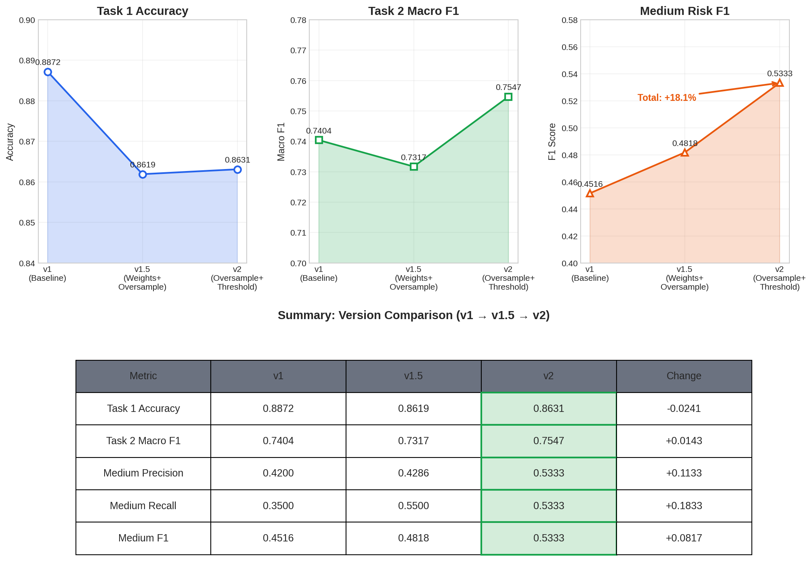
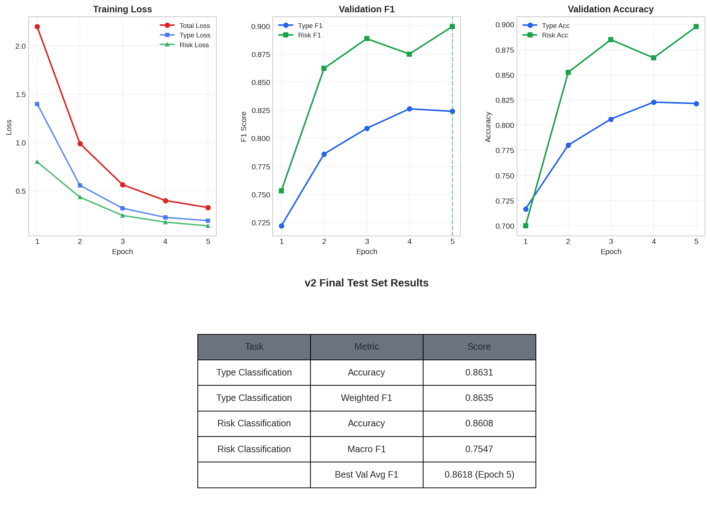

# AraContract Analyzer

AI-powered Arabic contract analysis API. Automatically extracts, segments, classifies, and summarizes Arabic legal contracts using machine learning and NLP.

## Features

- **Text Extraction**: Extract text from PDFs (digital) and scanned documents (OCR)
- **Clause Segmentation**: Split contracts into individual clauses using Arabic legal markers
- **Type Classification**: Classify each clause into 8 canonical legal categories
- **Risk Assessment**: Detect low/medium/high risk levels with explanatory warnings
- **Executive Summary**: Generate Arabic summaries of contract key points
- **Contract Comparison**: Compare two contracts for differences

## Quick Start

### Prerequisites

```bash
# Python 3.10+
# Node.js 18+ (for frontend)
```

### Backend Setup

```bash
cd AraContract_Analyzer/backend

# Create virtual environment
python -m venv .venv
source .venv/bin/activate

# Install dependencies
pip install -r requirements.txt

# Start the server
uvicorn app.main:app --host 0.0.0.0 --port 8000 --reload
```

Access API docs at `http://localhost:8000/docs`

### Frontend Setup

```bash
cd frontend
npm install
npm run dev
```

## API Endpoints

All endpoints are under `/api/contract/`

### 1. Full Analysis (Recommended)

Analyze an entire contract in one call:

```bash
curl -X POST http://localhost:8000/api/contract/analyze \
  -F "file=@contract.pdf"
```

**Response:**

```json
{
  "filename": "contract.pdf",
  "is_scanned": false,
  "clauses": [
    {
      "text": "...",
      "predicted_type_clause": "payment_financial",
      "type_display_name": "الشؤون المالية والدفع",
      "predicted_risk_level": "high",
      "risk_display_name": "عالي",
      "warning": "هذا البند قد يكون مجحفاً..."
    }
  ],
  "summary": "ملخص تنفيذي للعقد...",
  "stats": {
    "total_clauses": 15,
    "high_risk_clauses": 3,
    "medium_risk_clauses": 5,
    "low_risk_clauses": 7,
    "type_distribution": {...}
  }
}
```

### 2. Upload & Extract Text

```bash
curl -X POST http://localhost:8000/api/contract/upload \
  -F "file=@contract.pdf"
```

### 3. Segment

#### A. Segment text

```bash
curl -X POST http://localhost:8000/api/contract/segment \
  -H "Content-Type: application/json" \
  -d '{"text": "المادة الأولى: يلتزم الطرف الأول..."}'
```

#### B. Segment File

```bash
curl -X POST http://localhost:8000/api/contract/segment/file \
  -H "Content-Type: application/json" \
  -F "file=@/path/to/contract.pdf"
```

### 4. Classify Clause(s)

Single clause:

```bash
curl -X POST http://localhost:8000/api/contract/classify \
  -H "Content-Type: application/json" \
  -d '{"text": "يلتزم الطرف الأول بدفع المبلغ خلال 30 يوماً"}'
```

Batch classification:

```bash
curl -X POST http://localhost:8000/api/contract/classify/batch \
  -H "Content-Type: application/json" \
  -d '{"texts": ["clause 1", "clause 2"]}'
```

### 5. Generate Summary

```bash
curl -X POST http://localhost:8000/api/contract/summarize \
  -H "Content-Type: application/json" \
  -d '{
    "text": "full contract text...",
    "classified_clauses": [...]
  }'
```

### 6. Compare Contracts

```bash
curl -X POST http://localhost:8000/api/contract/compare \
  -F "file1=@contract1.pdf" \
  -F "file2=@contract2.pdf"
```

## Clause Types

| Type                     | Arabic                        | Description                        |
|--------------------------|-------------------------------|------------------------------------|
| `general_provisions`     | أحكام عامة                    | General provisions                 |
| `payment_financial`      | الشؤون المالية والدفع         | Payment & financial terms          |
| `party_obligations_a`    | التزامات الطرف الأول          | Obligations of party A             |
| `party_obligations_b`    | التزامات الطرف الثاني         | Obligations of party B             |
| `duration_expiration`    | المدة والانتهاء                | Duration & expiration              |
| `termination`            | الإنهاء والفسخ                | Termination                        |
| `penalties_damages`      | العقوبات والتعويضات           | Penalties & damages                |
| `dispute_resolution`     | حل النزاعات                   | Dispute resolution                 |

## Risk Levels

| Level    | Arabic | Description              |
|----------|--------|--------------------------|
| `low`    | منخفض  | Standard clauses         |
| `medium` | متوسط  | Requires attention       |
| `high`   | عالي   | Potentially unfair/risky |

## Model Information

- **Base Model**: CAMeL-Lab/bert-base-arabic-camelbert-msa
- **Task**: Multi-task classification (clause type + risk level)
- **Training**: See `AraContract_Training_Colab.ipynb` for training notebook
- **Checkpoint**: `models/checkpoints/aracontract_v2_best.pt`

## Version History

### v2 (Current) — Oversampling + Threshold Tuning

| Task | Metric | Score |
|---|---|---|
| **Type Classification** | Accuracy | **0.8631** |
| **Risk Level** | Macro F1 | **0.7547** |
| **Risk Level** | Medium F1 | **0.5333** |

**Improvements:**
- ✅ Medium recall: 35% → 53% (+18%)
- ✅ Macro F1: 0.7404 → 0.7547 (+2%)
- ✅ Balanced precision/recall across all risk levels

**Key changes from v1:**
- WeightedRandomSampler for class imbalance
- Threshold tuning (0.43 optimal for medium class)
- No class weights (avoided double compensation)

### v1.5 — Class Weights + Oversampling (Experimental)

| Task | Metric | Score |
|---|---|---|
| **Type Classification** | Accuracy | 0.8619 |
| **Risk Level** | Macro F1 | 0.7317 |
| **Risk Level** | Medium F1 | 0.4818 |

**Learnings:**
- Class weights + oversampling caused over-compensation
- Medium precision dropped to 0.43 (too many false positives)
- Led to v2 approach: oversampling only

### v1 (Baseline) — Original Model

| Task | Metric | Score |
|---|---|---|
| **Type Classification** | Accuracy | 0.8872 |
| **Risk Level** | Macro F1 | 0.7404 |
| **Risk Level** | Medium F1 | 0.4516 |

**Limitations:**
- ❌ Medium recall only 35% (missed 65% of medium-risk clauses)
- ❌ No imbalance handling
- ❌ Fixed threshold (0.5)

For detailed comparison and analysis, see [`VERSION_COMPARISON.md`](VERSION_COMPARISON.md).

## Version Comparison Plots

Generated via `python3 plot_version_comparison.py`:



- **[plots/v1_v2_overview.png](plots/v1_v2_overview.png)** — Overall Task 1 & Task 2 metrics across versions
- **[plots/medium_class_evolution.png](plots/medium_class_evolution.png)** — Medium class precision/recall/F1 improvement
- **[plots/risk_breakdown_v2.png](plots/risk_breakdown_v2.png)** — Per-class metrics for final v2 model
- **[plots/data_distribution.png](plots/data_distribution.png)** — Class imbalance visualization
- **[plots/dashboard_summary.png](plots/dashboard_summary.png)** — Single-page summary dashboard

---

## Training History & Plots

### v2 Training Summary (Current Model)

| Metric | Value |
|---|---|
| **Best Val Avg F1** | 0.8618 (Epoch 5) |
| **Test Type Accuracy** | 0.8631 |
| **Test Type Weighted F1** | 0.8635 |
| **Test Risk Accuracy** | 0.8608 |
| **Test Risk Macro F1** | 0.7547 (threshold-adjusted) |
| **Training epochs** | 5 |

**v2 Training Logs:**

| Epoch | Train Loss | Type Loss | Risk Loss | Val Type F1 | Val Risk F1 | Val Type Acc | Val Risk Acc |
|---|---|---|---|---|---|---|---|
| 1 | 2.1983 | 1.3997 | 0.7985 | 0.7219 | 0.7531 | 0.7167 | 0.6999 |
| 2 | 0.9885 | 0.5557 | 0.4328 | 0.7860 | 0.8624 | 0.7801 | 0.8525 |
| 3 | 0.5624 | 0.3186 | 0.2438 | 0.8089 | 0.8889 | 0.8060 | 0.8849 |
| 4 | 0.3986 | 0.2238 | 0.1748 | 0.8263 | 0.8752 | 0.8228 | 0.8668 |
| 5 | 0.3261 | 0.1897 | 0.1364 | 0.8241 | 0.8996 | 0.8215 | 0.8978 |

**v2 Training Plots** (generated via `python3 plot_v2_training.py`):



- **[plots/v2_training_loss.png](plots/v2_training_loss.png)** — Training loss curves (total, type, risk)
- **[plots/v2_val_f1.png](plots/v2_val_f1.png)** — Validation F1 scores across epochs
- **[plots/v2_val_accuracy.png](plots/v2_val_accuracy.png)** — Validation accuracy across epochs
- **[plots/v2_type_per_class.png](plots/v2_type_per_class.png)** — Per-class metrics for clause type (test set)
- **[plots/v2_risk_per_class.png](plots/v2_risk_per_class.png)** — Per-class metrics for risk level (test set, threshold-adjusted)
- **[plots/v2_training_dashboard.png](plots/v2_training_dashboard.png)** — Single-page v2 training summary

---

### v1 Training History (Baseline)

- **Best Avg F1:** 0.8825 (Epoch 5)
- **Test Type F1:** 0.8882 — accuracy 88.72%
- **Test Risk F1:** 0.8702 — accuracy 87.57%
- **Training epochs:** 5 (see full training log in `Notes.md`)

The training logs and per-step metrics are saved in `Notes.md` and the notebook `AraContract_Training_Colab.ipynb` — you can re-run the notebook to reproduce training plots and regenerate the HTML report.

#### v1 Plots (generated)

Epoch F1 curve (Type & Risk across 5 epochs):


Val Type F1 — before vs after `party_obligations` split:


Per-class F1 — 8-class model (test set):


Per-class F1 comparison — before (7 classes) vs after (8 classes):


F1 change per class after the split:


Class metrics table (precision / recall / F1 / support):


Test set metrics summary:


## Python Usage (Direct Inference)

```python
from app.models.inference import AraContractInference

# Load model
model = AraContractInference("path/to/checkpoint.pt")

# Single prediction
result = model.predict_single("يلتزم الطرف الأول بدفع...")
print(result["predicted_type_clause"])
print(result["predicted_risk_level"])

# Batch prediction
results = model.predict_batch(["clause 1", "clause 2"])
```

## File Upload Limits

| Setting         | Value                          |
|-----------------|--------------------------------|
| Max file size   | 20 MB                          |
| Allowed formats | PDF, PNG, JPG, JPEG, TIFF, BMP |

## Configuration

Environment variables (via `.env`):

```bash
# Server
HOST=0.0.0.0
PORT=8000

# CORS
ALLOWED_ORIGINS=["http://localhost:3000"]

# Model paths
CLASSIFIER_MODEL_PATH=../models/checkpoints/aracontract_v1_best.pt

# Processing
MAX_SEQ_LENGTH=512
CHUNK_SIZE=500
```

## Project Structure

```text
AraContract_Analyzer/
├── backend/
│   ├── app/
│   │   ├── main.py          # FastAPI app
│   │   ├── routers/         # API endpoints
│   │   ├── models/          # Inference & schemas
│   │   ├── services/        # Business logic
│   │   └── core/            # Config & exceptions
│   └── tests/
├── models/
│   ├── checkpoints/         # Trained models
│   ├── config.py            # Training config
│   ├── train.py             # Training script
│   └── inference.py         # Inference wrapper
├── frontend/                # React UI
├── data/                    # Training data
└── scripts/                 # Utility scripts
```

## License

MIT
