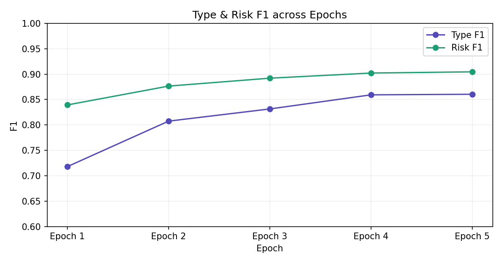
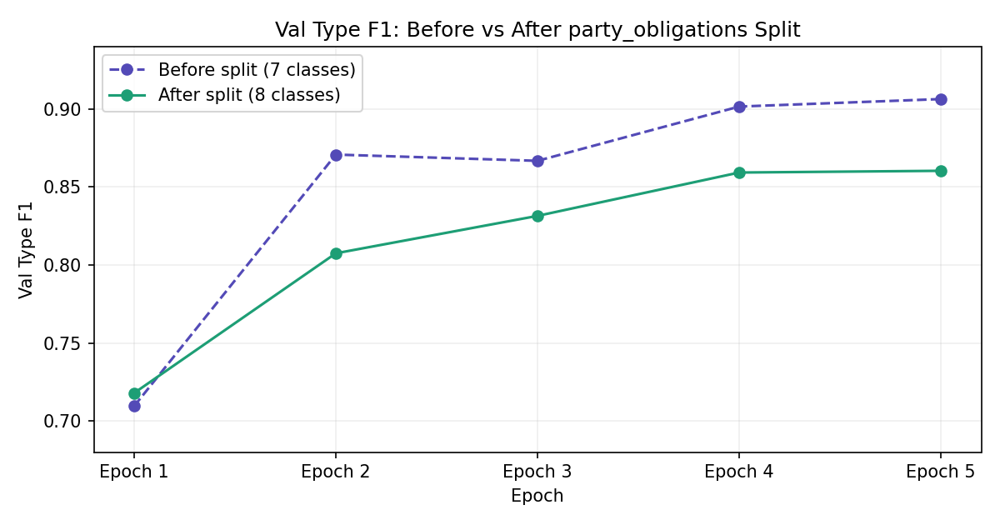
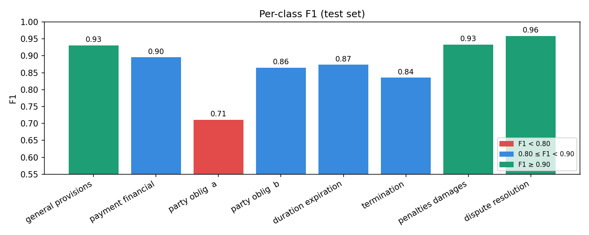
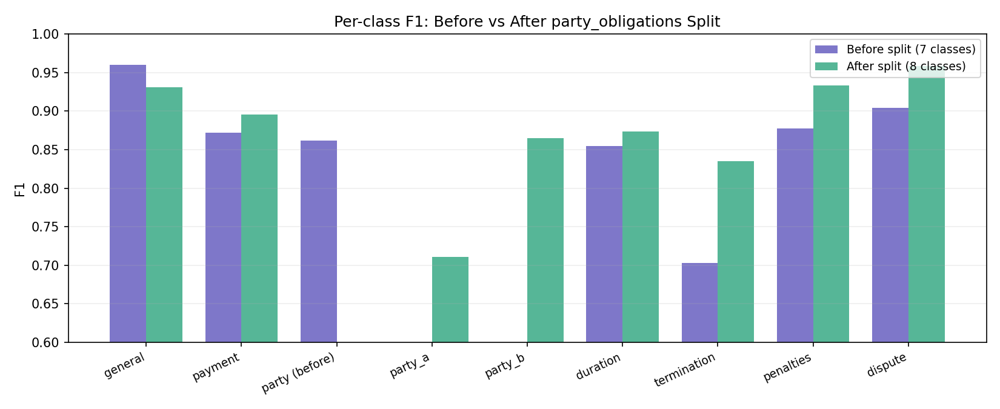
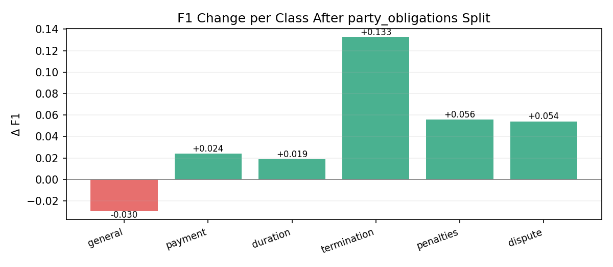
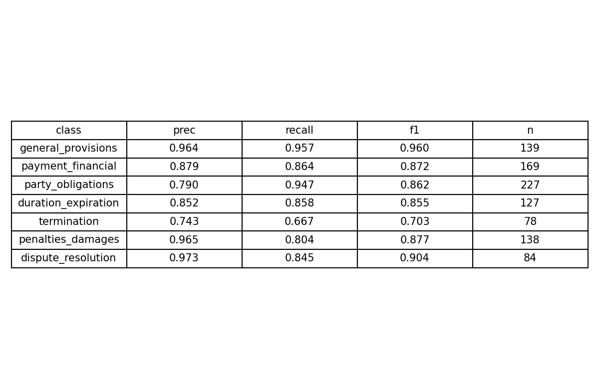
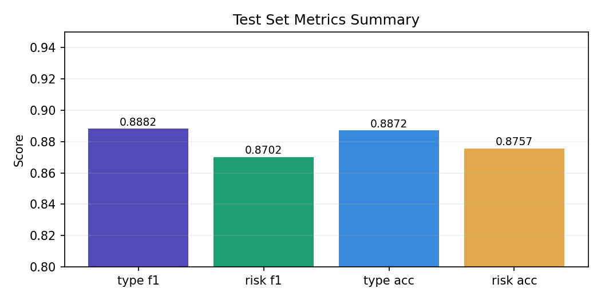

# AraContract Analyzer

AI-powered Arabic contract analysis API. Automatically extracts, segments, classifies, and summarizes Arabic legal contracts using machine learning and NLP.

## Features

- **Text Extraction**: Extract text from PDFs (digital) and scanned documents (OCR)
- **Clause Segmentation**: Split contracts into individual clauses using Arabic legal markers
- **Type Classification**: Classify each clause into 8 canonical legal categories
- **Risk Assessment**: Detect low/medium/high risk levels with explanatory warnings
- **Executive Summary**: Generate Arabic summaries of contract key points
- **Contract Comparison**: Compare two contracts for differences

## Quick Start

### Prerequisites

```bash
# Python 3.10+
# Node.js 18+ (for frontend)
```

### Backend Setup

```bash
cd AraContract_Analyzer/backend

# Create virtual environment
python -m venv .venv
source .venv/bin/activate

# Install dependencies
pip install -r requirements.txt

# Start the server
uvicorn app.main:app --host 0.0.0.0 --port 8000 --reload
```

Access API docs at `http://localhost:8000/docs`

### Frontend Setup

```bash
cd frontend
npm install
npm run dev
```

## API Endpoints

All endpoints are under `/api/contract/`

### 1. Full Analysis (Recommended)

Analyze an entire contract in one call:

```bash
curl -X POST http://localhost:8000/api/contract/analyze \
  -F "file=@contract.pdf"
```

**Response:**

```json
{
  "filename": "contract.pdf",
  "is_scanned": false,
  "clauses": [
    {
      "text": "...",
      "predicted_type_clause": "payment_financial",
      "type_display_name": "الشؤون المالية والدفع",
      "predicted_risk_level": "high",
      "risk_display_name": "عالي",
      "warning": "هذا البند قد يكون مجحفاً..."
    }
  ],
  "summary": "ملخص تنفيذي للعقد...",
  "stats": {
    "total_clauses": 15,
    "high_risk_clauses": 3,
    "medium_risk_clauses": 5,
    "low_risk_clauses": 7,
    "type_distribution": {...}
  }
}
```

### 2. Upload & Extract Text

```bash
curl -X POST http://localhost:8000/api/contract/upload \
  -F "file=@contract.pdf"
```

### 3. Segment

#### A. Segment text

```bash
curl -X POST http://localhost:8000/api/contract/segment \
  -H "Content-Type: application/json" \
  -d '{"text": "المادة الأولى: يلتزم الطرف الأول..."}'
```

#### B. Segment File

```bash
curl -X POST http://localhost:8000/api/contract/segment/file \
  -H "Content-Type: application/json" \
  -F "file=@/path/to/contract.pdf"
```

### 4. Classify Clause(s)

Single clause:

```bash
curl -X POST http://localhost:8000/api/contract/classify \
  -H "Content-Type: application/json" \
  -d '{"text": "يلتزم الطرف الأول بدفع المبلغ خلال 30 يوماً"}'
```

Batch classification:

```bash
curl -X POST http://localhost:8000/api/contract/classify/batch \
  -H "Content-Type: application/json" \
  -d '{"texts": ["clause 1", "clause 2"]}'
```

### 5. Generate Summary

```bash
curl -X POST http://localhost:8000/api/contract/summarize \
  -H "Content-Type: application/json" \
  -d '{
    "text": "full contract text...",
    "classified_clauses": [...]
  }'
```

### 6. Compare Contracts

```bash
curl -X POST http://localhost:8000/api/contract/compare \
  -F "file1=@contract1.pdf" \
  -F "file2=@contract2.pdf"
```

## Clause Types

| Type                     | Arabic                        | Description                        |
|--------------------------|-------------------------------|------------------------------------|
| `general_provisions`     | أحكام عامة                    | General provisions                 |
| `payment_financial`      | الشؤون المالية والدفع         | Payment & financial terms          |
| `party_obligations_a`    | التزامات الطرف الأول          | Obligations of party A             |
| `party_obligations_b`    | التزامات الطرف الثاني         | Obligations of party B             |
| `duration_expiration`    | المدة والانتهاء                | Duration & expiration              |
| `termination`            | الإنهاء والفسخ                | Termination                        |
| `penalties_damages`      | العقوبات والتعويضات           | Penalties & damages                |
| `dispute_resolution`     | حل النزاعات                   | Dispute resolution                 |

## Risk Levels

| Level    | Arabic | Description              |
|----------|--------|--------------------------|
| `low`    | منخفض  | Standard clauses         |
| `medium` | متوسط  | Requires attention       |
| `high`   | عالي   | Potentially unfair/risky |

## Model Information

- **Base Model**: CAMeL-Lab/bert-base-arabic-camelbert-msa
- **Task**: Multi-label classification (type + risk)
- **Training**: See `AraContract_Training_Colab.ipynb` for training notebook
- **Checkpoint**: `models/checkpoints/aracontract_v1_best.pt`

## Training History & Plots

- **Best Avg F1:** 0.8825 (Epoch 5)
- **Test Type F1:** 0.8882 — accuracy 88.72%
- **Test Risk F1:** 0.8702 — accuracy 87.57%
- **Training epochs:** 5 (see full training log in `Notes.md`)

The training logs and per-step metrics are saved in `Notes.md` and the notebook `AraContract_Training_Colab.ipynb` — you can re-run the notebook to reproduce training plots and regenerate the HTML report.

### Plots (generated)

Epoch F1 curve (Type & Risk across 5 epochs):



Val Type F1 — before vs after `party_obligations` split:



Per-class F1 — 8-class model (test set):



Per-class F1 comparison — before (7 classes) vs after (8 classes):



F1 change per class after the split:



Class metrics table (precision / recall / F1 / support):



Test set metrics summary:



## Python Usage (Direct Inference)

```python
from app.models.inference import AraContractInference

# Load model
model = AraContractInference("path/to/checkpoint.pt")

# Single prediction
result = model.predict_single("يلتزم الطرف الأول بدفع...")
print(result["predicted_type_clause"])
print(result["predicted_risk_level"])

# Batch prediction
results = model.predict_batch(["clause 1", "clause 2"])
```

## File Upload Limits

| Setting         | Value                          |
|-----------------|--------------------------------|
| Max file size   | 20 MB                          |
| Allowed formats | PDF, PNG, JPG, JPEG, TIFF, BMP |

## Configuration

Environment variables (via `.env`):

```bash
# Server
HOST=0.0.0.0
PORT=8000

# CORS
ALLOWED_ORIGINS=["http://localhost:3000"]

# Model paths
CLASSIFIER_MODEL_PATH=../models/checkpoints/aracontract_v1_best.pt

# Processing
MAX_SEQ_LENGTH=512
CHUNK_SIZE=500
```

## Project Structure

```text
AraContract_Analyzer/
├── backend/
│   ├── app/
│   │   ├── main.py          # FastAPI app
│   │   ├── routers/         # API endpoints
│   │   ├── models/          # Inference & schemas
│   │   ├── services/        # Business logic
│   │   └── core/            # Config & exceptions
│   └── tests/
├── models/
│   ├── checkpoints/         # Trained models
│   ├── config.py            # Training config
│   ├── train.py             # Training script
│   └── inference.py         # Inference wrapper
├── frontend/                # React UI
├── data/                    # Training data
└── scripts/                 # Utility scripts
```

## License

MIT
